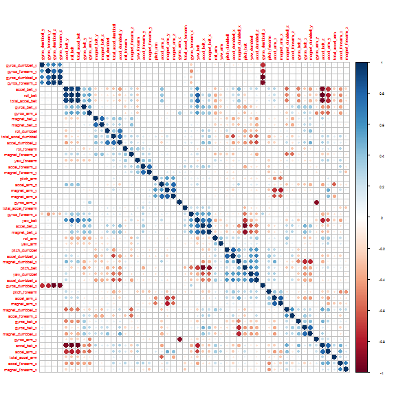
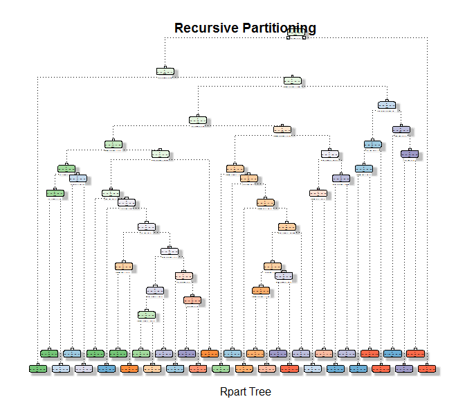
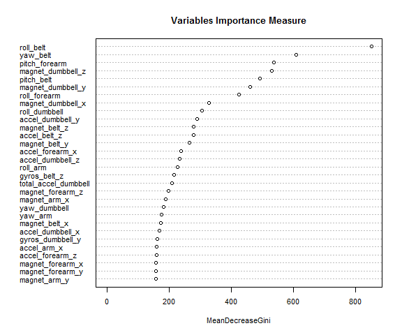
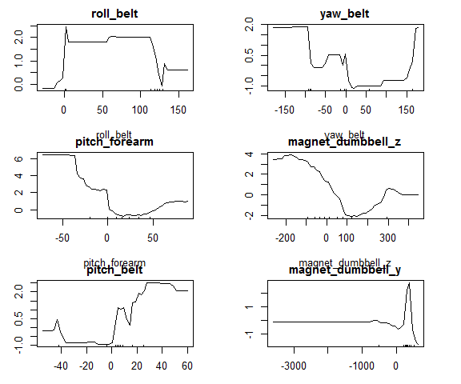

# Analysis and prediction of fitness exercises patterns
Author: Paolo Di Lorenzo  

# Executive summary
The goal of this project is to predict the manner in which people do their exercises. This is the "classe" variable in the training set. The dataset contains almost 160 variables that comes from measurements from fit bands and similar devices.
I will proceed with the following strategy:

1. Load the training and testing dataset and divide the training in a training dataset and a validation dataset
2. Perform an exploratory data analysis and data cleaning to reduce the number of variables and delete useless variables
3. Perform a first basic classification using a Recursive partitioning method with cross validation
4. Perform classification using a Random Forest model with out-of-bag method
5. Perform classification using a Generalized Boosted Regression model
5. Try to predict a validation dataset for the 3 models plus a combination of the 3 to find the better model
6. Evaluate the accuracy of the models and predict the testing dataset

# Step 1 - Step 2 - Load, divide and clean the datasets
   
The two steps are bound together since I will present only the result of the analysis performed.
I've loaded the dataset with #DIV/0! and null values as NA strings to easily remove them later. Most of the columns in fact have very few data (600 observation out of 19K samples) so I remove all these columns getting 60 complete columns.
Then I remove the first seven columns that contain useless information such as date, timestamp ...
I finally get a 53 column dataset that I split in 70% for training and 30% for validation. 


```r
library(corrplot)
library(caret)
library(randomForest)
library(rattle)
library(rpart)
library(rpart.plot)
library(gbm)
library(plyr)
set.seed(123321)
# load the train and test dataset
intrain <- read.csv("pml-training.csv", na.strings = c("NA", "#DIV/0!", ""))
intest <- read.csv("pml-testing.csv", na.strings = c("NA", "#DIV/0!", ""))
# remove all the columns with NA's - there are 60 columns left
intrain <- intrain[, apply(intrain, 2, function(x) !any(is.na(x)))]
intest <- intest[, apply(intest, 2, function(x) !any(is.na(x)))]
# remove the first 7 columns that contain the date and other irrelevant
# stuff - there are 53 columns left
intrain <- intrain[, -c(1:7)]
intest <- intest[, -c(1:7)]
# convert classe to factor
intrain$classe <- as.factor(intrain$classe)
# create a training partition with 70% of the data and a validation with 30%
# of the data
inval <- createDataPartition(y = intrain$classe, p = 0.7, list = F)
training <- intrain[inval, ]
validation <- intrain[-inval, ]
```
   
The training dataset contains more than 13000 samples 
   

```r
dim(training)
```

```
## [1] 13737    53
```

```r
# create a correlation plot to graphically analyze the data
par(cex = 0.4)
corrplot(cor(subset(training, select = -c(classe))), order = "hclust")
```


   
The plot shows that quite a few variables are highly correlated, both positive correlation (in blue) and negative correlation (in red). As we will see later the higher correlated valueswill be in the top positions in the classification models.
All the tuning parameters of the following classification models have come after days of trials and are a compromise between speed of computation, memory availability (4Gb available) and resulting accuracy. I've set a fixed seed at the beginning of this article so it can be replicated.

# Step 3 - Fit a Recursive Partitioning model with Cross Validation

Since this is a classification problem I try a basic classification model, but, to increase the performance (49% accuracy on a base model I've tried), I have included a Repeated Cross Validation re-sampling training control.
The plot shows the tree model obtained, even though it is quite unreadable because it is quite broad.


```r
ctrl = trainControl(allowParallel = T, method = "repeatedcv", number = 20, repeats = 20)
mod_rpart <- train(as.factor(classe) ~ ., data = training, method = "rpart", 
    tuneLength = 25, trControl = ctrl)
# plot the tree model
fancyRpartPlot(mod_rpart$finalModel, main = "Recursive Partitioning", sub = "Rpart Tree")
```

```
## Warning: labs do not fit even at cex 0.15, there may be some overplotting
```



# Step 4 - Fit a Random Forest model

The next model is a Random Forest the perform usually very well in classification problems, I've used a Out-of-band re-sampling because I've tested that it performs better than other re-sampling methods on this problem. 
The plot shows the most influencing variables and the partial plots the influence of the first 6 variables.


```r
# train a random forest with oob resampling
ctrl <- trainControl(method = "oob", number = 5)
mod_rf2 <- randomForest(classe ~ ., data = training, importance = T, ntree = 500)
# plot the relative importance variables of the random forest
par(cex = 0.7)
varImpPlot(mod_rf2, type = 2, main = "Variables Importance Measure")
```



```r
# plot the 6 most important variables of the random forest model
par(mfrow = c(3, 2), xpd = NA)
par(mar = c(3, 3, 2, 3))
adf <- as.data.frame(mod_rf2$importance)
names_1 = rownames(adf[order(-adf[, 7]), ])[1:6]
par(cex = 0.8)
for (name in names_1) partialPlot(mod_rf2, training, eval(name), xlab = name, 
    main = name)
```



# Step 5 - Fit a Generalized Boosted Regression Model

The last model I've tested (tried also KNN and neural nets) is the GBM (Generalized Boosted Regression Model) with cross validation.


```r
ctrl <- trainControl(method = "cv", number = 4)
gbm_grid <- expand.grid(n.trees = 300, interaction.depth = 3, shrinkage = 0.01, 
    n.minobsinnode = 5)
mod_gbm <- train(classe ~ ., data = training, method = "gbm", trControl = ctrl, 
    tuneGrid = gbm_grid, verbose = F)
mod_gbm
```

```
## Stochastic Gradient Boosting 
## 
## 13737 samples
##    52 predictor
##     5 classes: 'A', 'B', 'C', 'D', 'E' 
## 
## No pre-processing
## Resampling: Cross-Validated (4 fold) 
## Summary of sample sizes: 10303, 10302, 10303, 10303 
## Resampling results
## 
##   Accuracy  Kappa     Accuracy SD  Kappa SD   
##   0.852733  0.813292  0.005047086  0.006335865
## 
## Tuning parameter 'n.trees' was held constant at a value of 300
##  3
## Tuning parameter 'shrinkage' was held constant at a value of
##  0.01
## Tuning parameter 'n.minobsinnode' was held constant at a value of 5
## 
```

```r
# par(mfrow=c(3, 2), xpd=NA) par(mar=c(3,2,2,3)) for (i in 1:6)
# plot(mod_gbm$finalModel, i.var = i,ann=T)
```
   

# Step 6 - Evaluate the out of sample accuracy of the models and predict the testing dataset

   
Now that I've finally collected the models I'd like to use on the specific case, I use the 3 models to predict the validation subset.
I also try combing the Recursive Partitioning with the Random Forest and the Generalized Boosted Regression to see if I get a better performance.
   

```r
# evaluate the prediction of the 3 models and create the new data frame of
# the 3 prediction combined
pred_rpart <- predict(mod_rpart, validation)
pred_rf2 <- predict(mod_rf2, validation)
pred_gbm <- predict(mod_gbm, validation)
predDF <- data.frame(pred_rpart, pred_rf2, pred_gbm, classe = validation$classe)

# train a new random forest with the new data frame
ctrl <- trainControl(method = "cv", number = 5)
combModFit <- train(classe ~ ., method = "rf", data = predDF, importance = T, 
    ntree = 200)
combPred <- predict(combModFit, predDF)
```
   
As can be seen from the Accuracy of the confusion matrix of each model, the random forest is the model that performs better.
   

```r
# create a list of the accuracies of the 4 models
accu_list <- as.data.frame(rbind(confusionMatrix(pred_rpart, validation$classe)$overall[1], 
    confusionMatrix(pred_rf2, validation$classe)$overall[1], confusionMatrix(pred_gbm, 
        validation$classe)$overall[1], confusionMatrix(combPred, predDF$classe)$overall[1]))
rownames(accu_list) <- c("Recursive Partitioning", "Random Forest with OOB", 
    "Generalized Boosted Regression", "Combination of the 3")
accu_list
```

```
##                                 Accuracy
## Recursive Partitioning         0.7901444
## Random Forest with OOB         0.9949023
## Generalized Boosted Regression 0.8525064
## Combination of the 3           0.9949023
```
   
The accuracy of the Random Forest on the out of sample dataset is 99.4902294% that is quite high and reliable and equal to the combination of the 3 models together so I will use the trained random forest as the predicting model.
To get the final classification from the testing dataset I use the best model found so far and I get the classification values.
   
   

```r
# since the random forest has the best accuracy it will be used for the test
# prediction
prediction_test <- predict(mod_rf2, intest)
prediction_test
```

```
##  1  2  3  4  5  6  7  8  9 10 11 12 13 14 15 16 17 18 19 20 
##  B  A  B  A  A  E  D  B  A  A  B  C  B  A  E  E  A  B  B  B 
## Levels: A B C D E
```
